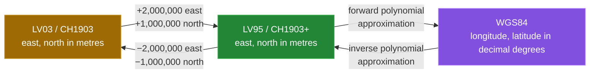
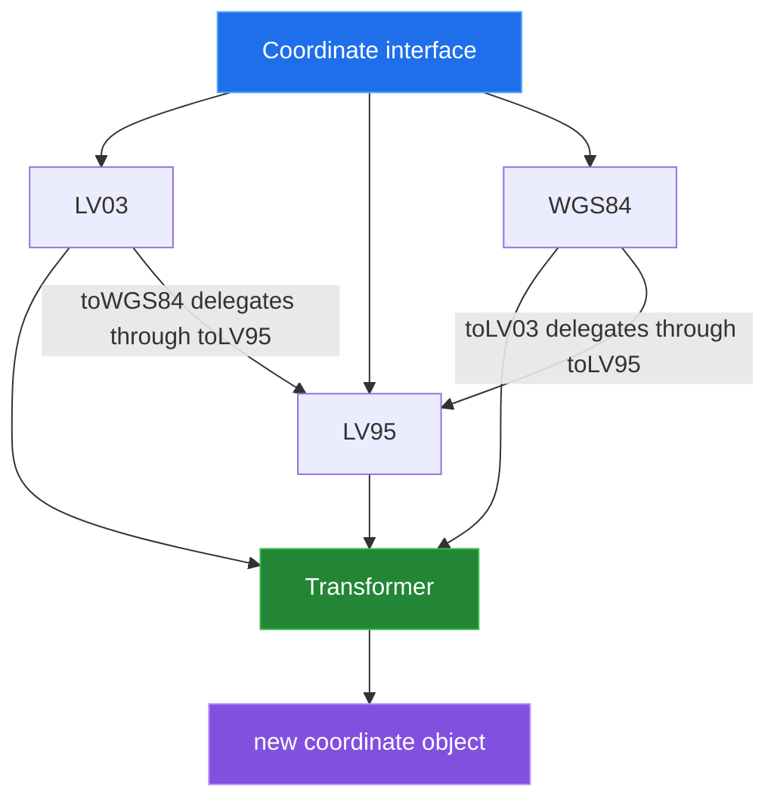

# SwissToWGS4j

SwissToWGS4j is a small Java library for converting between the Swiss national
grid LV03 (CH1903), the newer LV95 (CH1903+), and geographic WGS84 longitude,
latitude coordinates. It exposes the three coordinate types through one
`Coordinate` interface and keeps the transformation formulas in `Transformer`.
The LV03/LV95 relationship is a fixed offset; the LV95/WGS84 relationship is a
projection approximation.



## Quick start

The project targets Java `11` and builds with Maven. Because the `pom.xml` does
not configure a remote artifact repository, install the library locally first:

```sh
mvn -q -Dgpg.skip=true install
```

This runs in the Linux container used for the [measurements](docs/measurement.md). A consumer
project can then declare the coordinates from this repository:

```xml
<dependency>
  <groupId>ch.bissbert</groupId>
  <artifactId>SwissToWGS4j</artifactId>
  <version>1.0</version>
</dependency>
```

The working direction is an object conversion:

```java
import ch.bissbert.swisstowgs4j.LV95;
import ch.bissbert.swisstowgs4j.WGS84;

LV95 swiss = new LV95(2_600_000.0, 1_200_000.0);
WGS84 geographic = swiss.toWGS84();
System.out.printf("lon=%.9f lat=%.9f%n",
        geographic.getLongitude(), geographic.getLatitude());
```

Verified output:

```text
lon=7.438637222 lat=46.951081111
```

The inverse direction works the same way, in decimal degrees and in
longitude-then-latitude order:

```java
import ch.bissbert.swisstowgs4j.LV95;
import ch.bissbert.swisstowgs4j.WGS84;

LV95 swiss = new WGS84(7.438632, 46.951082).toLV95();
System.out.printf("east=%.4f north=%.4f%n", swiss.getEast(), swiss.getNorth());
```

Verified output:

```text
east=2599999.9488 north=1199999.9296
```

`Transformer.wgs84ToLV95(7.438632, 46.951082, null)` returns the same pair.
Both paths were fixed in `e532cde` and `b7b4bd9`.

## Architecture

Coordinate objects provide the public dispatch surface. They delegate the
actual arithmetic to `Transformer`; the chained paths go through LV95 where
needed.



## Capability table

| Starting type | Same type | LV03 | LV95 | WGS84 |
|---|---|---|---|---|
| `LV03` | returns itself | — | fixed offset | offset, then forward polynomial |
| `LV95` | returns itself | fixed offset | — | forward polynomial |
| `WGS84` | returns itself | via `toLV95()` | inverse polynomial | — |
| `Transformer` | — | static offset methods | static offset and<br/>inverse methods | static polynomial methods |

Heights are optional. The LV03/LV95 offset preserves a non-null height. The
LV95/WGS84 methods apply the vertical terms in their formulas. No validation of
coordinate ranges is performed.

## Results

The figures below come from `tools/linux-run.sh`, which runs the JUnit suite and
`python3 tools/measure.py` in a Linux container. The probe compiles the source
with `javac -Xlint:all` and runs `tools/Probe.java`.

| Check | Result |
|---|---:|
| Compiler warnings | 0 |
| LV03/LV95 sample points | 888 |
| LV03/LV95 step | 10,000 m |
| LV03/LV95 max east residual | 0.000000 m |
| LV03/LV95 max north residual | 0.000000 m |
| LV95/WGS84/LV95 max east residual | 3.752119 m |
| LV95/WGS84/LV95 max north residual | 3.016353 m |
| LV95/WGS84/LV95 max horizontal residual | 4.721508 m |
| LV95 → WGS84 vs REFRAME, 5 points in Switzerland | ≤ 2.0 m |
| LV95 → WGS84 vs REFRAME, 4 grid corners abroad | ≤ 4.3 m |
| WGS84 → LV95 vs REFRAME, 5 points | ≤ 1.0 m |
| JUnit tests | 28 run, 0 failures |

The round-trip residuals compare the two implemented polynomial formulas with
each other; the largest is at a grid corner outside Switzerland. The REFRAME
rows compare each direction with swisstopo's rigorous transformation. See
[How this was measured](docs/measurement.md).

## Tests

```sh
mvn -Dgpg.skip=true test   # needs a JDK 11+
sh tools/test.sh           # the same in a Linux container
```

The suite checks both polynomial directions against swisstopo REFRAME
reference points, the LV95/LV03 axis order, the round trip over the Swiss
grid, the height terms and same-system conversions.

## Repository layout

```text
src/main/java/ch/bissbert/swisstowgs4j/
  Coordinate.java   shared conversion interface
  LV03.java         CH1903 coordinate value
  LV95.java         CH1903+ coordinate value
  WGS84.java        geographic coordinate value
  Transformer.java  offset and polynomial transformations
src/test/java/...   JUnit suite
docs/               subsystem write-ups and measurement contract
tools/              measurement probe, test and Linux container runners
pom.xml             Maven coordinates and Java 11 compiler target
```

## Known limitations

- The LV95/WGS84 formulas are approximations: up to 2.0 m from swisstopo's
  REFRAME result in Switzerland and 4.3 m at the grid corners abroad.
- LV03/LV95 use the constant offset. swisstopo's rigorous LV03 conversion
  (FINELTRA) differs from it by up to about a metre away from Bern.
- `LV03` constructors take `north, east`, while `LV95` constructors take
  `east, north`. The static transformer methods use `east, north` for both
  Swiss systems.
- The project has no configured remote Maven repository. Consumers need an
  externally published artifact or a local `mvn install`.

Bugs are tracked as [GitHub issues](https://github.com/Bissbert/SwissToWGS4j/issues?q=label%3Abug).
