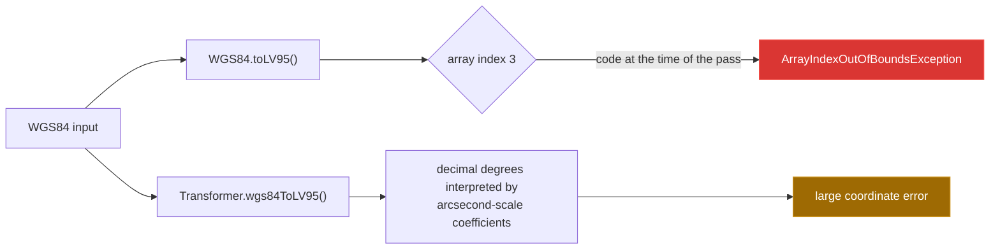

[← back to the overview](../README.md)

# Bugs found

This pass did not change tracked source code. The entries below record the
problems found in the implementation as it stood, and the fixes that were
considered separately.

> **Since this pass:** an independent adjudication confirmed all three entries,
> and a subsequent fix pass applied all three to the default branch: entry 1 in
> commit `e532cde`, entry 2 in commit `b7b4bd9` and entry 3 in commit `078e378`.
> `wgs84ToLV95` now scales latitude into the polynomial's `x` term and longitude
> into its `y` term while keeping the public `(longitude, latitude, height)`
> argument order in decimal degrees, `WGS84.toLV95()` checks index `2` of the
> three-element result, and the inverse method's Javadoc states its angular
> unit. Read the reproductions, the diagram and the example diffs below as the
> state at the time of the pass, not as the current state of the default branch.



## 1 — The inverse polynomial uses the wrong public units and order

**File and lines:** `src/main/java/ch/bissbert/swisstowgs4j/Transformer.java:49-61`

**What happens:** the public parameters are named `longitude` and `latitude`,
and `WGS84` stores decimal degrees. The current arithmetic subtracts constants
in the tens of thousands without converting degrees to arcseconds. The
coefficients also use the latitude-scale value for `x` and the longitude-scale
value for `y`. This is why the static method produces a near-LV95 result only
when called with latitude arcseconds first and longitude arcseconds second.

**Reproduction:** run `python3 tools/measure.py` and inspect the `bugs:` block.
The verified output includes:

```text
direct decimal degrees: E=1541561.8610 N=-4525615.7729
direct lat/lon arcseconds: E=2599999.9488 N=1199999.9296
```

The second call is an observation of the current formula's effective input
convention, not a documented API contract.

**Fix I would have made:**

```diff
@@
-     * @param longitude longitude in WGS84
-     * @param latitude  latitude in WGS84
+     * @param longitude longitude in WGS84 decimal degrees
+     * @param latitude  latitude in WGS84 decimal degrees
@@
-        double x = (longitude - 169028.66) / 10000;
-        double y = (latitude - 26782.5) / 10000;
+        double x = (latitude * 3600 - 169028.66) / 10000;
+        double y = (longitude * 3600 - 26782.5) / 10000;
```

This diff is recorded only; it is not applied in this pull request.

## 2 — `WGS84.toLV95()` reads past the returned array

**File and lines:** `src/main/java/ch/bissbert/swisstowgs4j/WGS84.java:38-40`

**What happens:** `Transformer.wgs84ToLV95()` allocates a three-element array,
but `WGS84.toLV95()` checks element `3`. Every call through the object API
therefore throws before it can construct an `LV95` result. `WGS84.toLV03()`
fails for the same reason because it delegates to `toLV95()`.

**Reproduction:** run `python3 tools/measure.py` and inspect the `quickstart:`
and `bugs:` blocks. The verified exception is:

```text
java.lang.ArrayIndexOutOfBoundsException: Index 3 out of bounds for length 3
```

**Fix I would have made:**

```diff
@@
-        if (lv95Data[3] == null) {
+        if (lv95Data[2] == null) {
```

This diff is recorded only; it is not applied in this pull request.

## 3 — The inverse-method Javadoc leaves the angular unit unspecified

**File and lines:** `src/main/java/ch/bissbert/swisstowgs4j/Transformer.java:49-50`

**What happens:** the parameter documentation says only “in WGS84”. It does
not tell a caller whether the values are decimal degrees or arcseconds, while
the class API exposes decimal-degree values and the current formula behaves as
described in bug 1.

**Reproduction:** inspect the Javadoc or run `nl -ba
src/main/java/ch/bissbert/swisstowgs4j/Transformer.java`. The ambiguity is in
the source; the unit mismatch is demonstrated by the `bugs` measurement above.

**Fix I would have made:**

```diff
@@
-     * @param longitude longitude in WGS84
-     * @param latitude  latitude in WGS84
+     * @param longitude longitude in WGS84 decimal degrees
+     * @param latitude  latitude in WGS84 decimal degrees
```

This documentation change is also recorded only; it is not applied in this
pull request.
