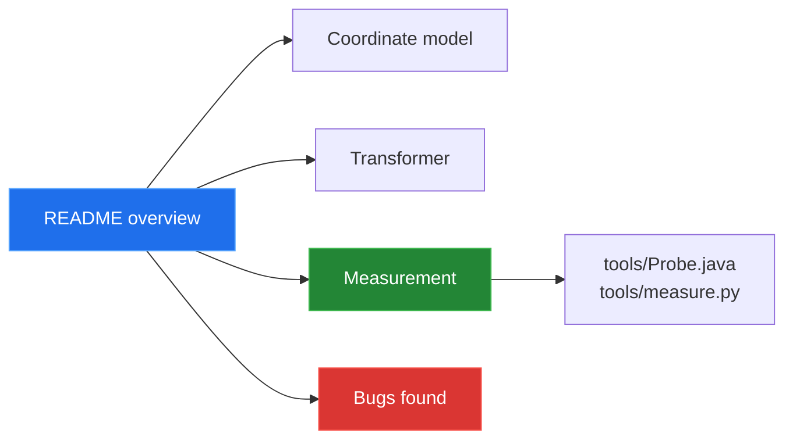

[← back to the overview](../README.md)

# Documentation

The library is small enough to explain by subsystem. The measurement runner is
in `tools/` because this repository had no existing measurement-tool tree.

| | Topic | In one line |
|---|---|---|
| 1 | [Coordinate model](coordinate-model.md) | Three coordinate value types share one conversion interface. |
| 2 | [Transformer](transformer.md) | LV03/LV95 use an offset; LV95/WGS84 use polynomial approximations. |
| 3 | [Bugs found](BUGS-FOUND.md) | Three fixed inverse-direction bugs and two open ones. |
| — | [Measurement](measurement.md) | The Linux container run: build, probe output, and what was not covered. |

