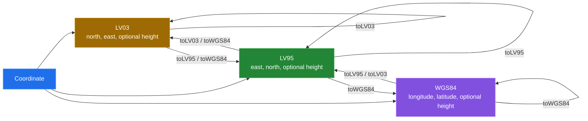

[← back to the overview](../README.md)

# Coordinate model

`Coordinate` is the common API. `LV03`, `LV95`, and `WGS84` are mutable-free
coordinate holders with getters and conversion methods. A conversion returns a
new value unless the target system is the same type, in which case the object
returns itself.

## Constructor and getter conventions

The constructors do not use one universal axis order. Keep the order visible
at call sites:

| Type | Constructor order | Getter names | Coordinate units |
|---|---|---|---|
| `LV03` | `north, east[, height]` | `getNorth()`, `getEast()` | metres |
| `LV95` | `east, north[, height]` | `getEast()`, `getNorth()` | metres |
| `WGS84` | `longitude, latitude[, height]` | `getLongitude()`, `getLatitude()` | decimal degrees; height is passed through the formulas |

The source stores the horizontal values as `double` or `Double`, depending on
the class. An omitted height is represented by `null`. `LV03` and `LV95`
conversion methods preserve a non-null height through the datum shift. The
LV95/WGS84 polynomial methods apply their own vertical correction when a
height is supplied.

## Conversion dispatch

The value objects delegate to `Transformer` rather than implementing the
polynomials themselves. `LV03.toWGS84()` first shifts to LV95, then calls the
LV95-to-WGS84 transform. `WGS84.toLV03()` first calls `toLV95()` and then the
constant LV95-to-LV03 shift.

`WGS84.toLV95()` returns a value and the static inverse takes decimal degrees
in longitude-then-latitude order (fixed in `b7b4bd9` and `e532cde`).
`LV95.toLV03()` and `WGS84.toLV03()` return north and east in the right
fields (fixed in [`c929f7e`](https://github.com/Bissbert/SwissToWGS4j/commit/c929f7e), entry 4 in [Bugs found](BUGS-FOUND.md)).
