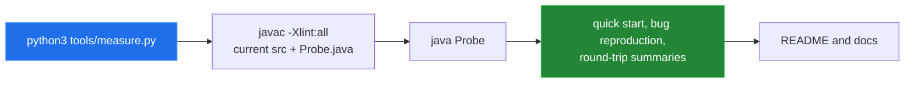

[← back to the overview](../README.md)

# How this was measured

Every numeric result in the documentation comes from a command run against the
current checkout. The measurement code is in [`tools/Probe.java`](../tools/Probe.java)
and [`tools/measure.py`](../tools/measure.py). The Python wrapper uses only the
standard library; a JDK is required to compile and run the probe.



## Build verification

The repository declares Java source and target level `11` in `pom.xml`. On the
machine used for this pass, these commands completed successfully:

```sh
mvn -q -Dgpg.skip=true test
mvn -q -Dgpg.skip=true package
mvn -q -Dgpg.skip=true install
```

The install step is needed for the local Maven dependency example in the
README because this repository does not configure a remote artifact
repository. The generated `target/` directory is not part of the pull request.

## Probe measurements

Run:

```sh
python3 tools/measure.py
```

The probe compiles the current source tree, so the output below includes the
current inverse-conversion bug. The compiler warning count and all values are
printed by the command, not hand-entered into the report.

```text
compiler.warning_count=0
quickstart:
LV95 -> WGS84: lon=7.438637222 lat=46.951081111 height=null
WGS84 -> LV95: !! java.lang.ArrayIndexOutOfBoundsException: Index 3 out of bounds for length 3
bugs:
direct decimal degrees: E=1541561.8610 N=-4525615.7729
direct lat/lon arcseconds: E=2599999.9488 N=1199999.9296
object conversion: !! java.lang.ArrayIndexOutOfBoundsException: Index 3 out of bounds for length 3
roundtrip:
roundtrip.step_m=10000
roundtrip.points=888
roundtrip.max_abs_east_m=148.254882
roundtrip.max_abs_north_m=7.482338
roundtrip.max_horizontal_m=148.443577
roundtrip.path=static methods with lat/lon arcseconds
shift:
shift.step_m=10000
shift.points=888
shift.max_abs_east_m=0.000000
shift.max_abs_north_m=0.000000
shift.height_exact=true
absolute_accuracy=not measured
```

## What the grid means

The `roundtrip` sample walks a fixed LV95 box in `10,000` m increments,
converts each point with `Transformer.lv95ToWGS84`, then calls the current
static inverse with latitude and longitude converted to arcseconds. The
largest residual is therefore a comparison of the two polynomial fits under
the method's observed convention. It is not an absolute error against a
reference dataset and must not be presented as one.

The `shift` sample applies `lv03ToLV95` and `lv95ToLV03` to the same number of
grid points with a non-null height. It checks horizontal residuals and compares
the height object for exact equality.

## Accuracy and coverage limits

Absolute projection accuracy against known reference points is **not measured**:
the repository has no reference-point fixtures or authoritative comparison
dataset. The source Javadoc's accuracy claim was not treated as a measurement.

No animation is shipped. This is a synchronous coordinate API with no
user-facing session to capture; Mermaid diagrams document the data flow without
inventing a recording.
