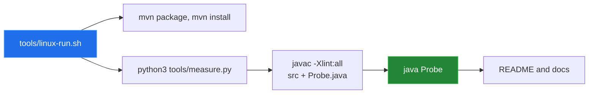

[← back to the overview](../README.md)

# How this was measured

Every result in the documentation comes from one script that runs in a Linux
container:

```sh
sh tools/linux-run.sh > media/captures/linux-run.txt
```

[`tools/linux-run.sh`](../tools/linux-run.sh) starts
`maven:3.9-eclipse-temurin-11`, mounts the repository read-only, copies it,
builds and installs the library with Maven, and runs
[`tools/measure.py`](../tools/measure.py). That script compiles the sources
together with [`tools/Probe.java`](../tools/Probe.java) using
`javac -Xlint:all` and prints what the probe measures. The full output is
[`media/captures/linux-run.txt`](../media/captures/linux-run.txt).



## Environment

| | |
|---|---|
| Kernel | Linux 6.5.11-linuxkit, aarch64 (Docker Desktop VM) |
| Image | `maven:3.9-eclipse-temurin-11` (`sha256:72b9e4bb…a5d3d7`) |
| JDK | OpenJDK 11.0.32 (Eclipse Temurin) |
| Maven | 3.9.16 |
| Python | 3.12.3 |
| Date | 2026-09-24 |

## Build

The repository declares Java source and target level `11` in `pom.xml`.

| Command | Result |
|---|---|
| `mvn -q -Dgpg.skip=true package` | exit 0; `SwissToWGS4j-1.0.jar`, `-sources.jar` and `-javadoc.jar` in `target/` |
| `mvn -q -Dgpg.skip=true install` | exit 0; the three jars in `~/.m2/repository/ch/bissbert/SwissToWGS4j/1.0/` |

The install step is what the README's dependency example needs, because the
`pom.xml` does not configure a remote artifact repository.

## Probe output

```text
compiler.warning_count=0
quickstart:
LV95 -> WGS84: lon=7.438637222 lat=46.951081111 height=null
WGS84 -> LV95: E=2599999.9488 N=1199999.9296 height=null
inverse:
static wgs84ToLV95, decimal degrees: E=2599999.9488 N=1199999.9296 h=null
WGS84.toLV95, no height -> LV95[E=2599999.9488 N=1199999.9296 h=null]
WGS84.toLV03, no height -> LV03[north=599999.9488 east=199999.9296 h=null]
roundtrip:
roundtrip.step_m=10000
roundtrip.points=888
roundtrip.max_abs_east_m=148.254882
roundtrip.max_abs_north_m=7.482338
roundtrip.max_horizontal_m=148.443577
roundtrip.path=static methods, decimal degrees
shift:
shift.step_m=10000
shift.points=888
shift.max_abs_east_m=0.000000
shift.max_abs_north_m=0.000000
shift.height_exact=true
api:
LV95.toWGS84 -> WGS84[lon=7.438637222 lat=46.951081111 h=589.55]
LV95.toLV03 -> LV03[north=600000.0000 east=200000.0000 h=540.0]
LV03.toLV95 -> LV95[E=2600000.0000 N=1200000.0000 h=540.0]
LV03.toWGS84 -> WGS84[lon=7.438637222 lat=46.951081111 h=589.55]
WGS84.toLV95 -> LV95[E=2599999.9488 N=1199999.9296 h=490.44575825839996]
WGS84.toLV03 -> LV03[north=599999.9488 east=199999.9296 h=490.44575825839996]
absolute_accuracy=not measured
```

## What the output shows

- **Compiler:** no warnings under `-Xlint:all`.
- **Inverse direction:** the static method and the object path both return
  `E=2599999.9488 N=1199999.9296` for a point in Bern. A missing height stays
  `null`. These are the fixes for entries 1 and 2 in
  [Bugs found](BUGS-FOUND.md).
- **LV03/LV95 shift:** 888 grid points at a `10,000` m step, converted there and
  back with a height of `500.0`. The horizontal residual is `0.000000` m and the
  height comes back unchanged.
- **LV95/WGS84 round trip:** the same grid in LV95 metres, converted to WGS84
  and back with the static methods in decimal degrees. The largest residual is
  148.44 m, mostly east. That is open entry 5: the forward longitude polynomial
  uses `x³` instead of `y³`. The residual compares the two implemented formulas
  with each other; it is not an absolute error.
- **`api:` block:** `LV95.toLV03` and `WGS84.toLV03` report north and east
  swapped. That is open entry 4.

## Not covered

- Absolute accuracy against known reference points. The repository has no
  reference-point fixtures, and the Javadoc's accuracy claim was not treated as
  a measurement.
- The repository has no unit tests; `mvn package` compiles and packages only.
