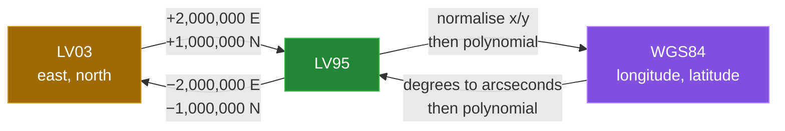

[← back to the overview](../README.md)

# Transformer

`Transformer` contains four static operations. Two are exact coordinate-origin
offsets between LV03 and LV95. The other two are polynomial approximations
between LV95 and WGS84.



## LV03 and LV95

The two Swiss grid systems are related here by fixed offsets:

```java
LV95 = LV03 + (2_000_000 east, 1_000_000 north)
LV03 = LV95 - (2_000_000 east, 1_000_000 north)
```

The `height` reference is returned unchanged by these two methods. The
measurement runner sampled `888` points in both directions with a `10,000` m
step; the largest observed horizontal residual was `0.000000` m and the
height comparison was exact. These are round-trip results for the fixed
offset, not a geodetic accuracy claim.

## LV95 to WGS84

The forward method normalises the LV95 axes as follows:

```text
y = (east  - 2600000) / 1000000
x = (north - 1200000) / 1000000
```

It evaluates one polynomial for longitude and one for latitude, then converts
the intermediate values with `* 100 / 36`. When height is non-null, the source
applies:

```text
wgs84Height = height + 49.55 - 12.60*y - 22.64*x
```

The verified quick-start sample is:

```text
LV95 -> WGS84: lon=7.438637222 lat=46.951081111 height=null
```

## WGS84 to LV95

The inverse method converts both angles to arcseconds, builds `x` from
latitude and `y` from longitude, and evaluates the inverse polynomials. The
call takes decimal degrees in the declared `(longitude, latitude, height)`
order:

```java
Double[] lv95 = Transformer.wgs84ToLV95(7.438632, 46.951082, null);
```

The result is:

```text
E=2599999.9488 N=1199999.9296
```

`new WGS84(7.438632, 46.951082).toLV95()` now returns the same pair.

## Accuracy boundary

The two polynomial directions are approximations. `ReferencePointsTest`
compares them with swisstopo's REFRAME service, which applies the rigorous
transformation:

| Direction | Points | Largest distance to REFRAME |
|---|---|---:|
| LV95 → WGS84 | 5 in Switzerland (Bern, Zurich, Chur, near Geneva, near Lugano) | 2.0 m |
| LV95 → WGS84 | 4 grid corners outside Switzerland | 4.3 m |
| WGS84 → LV95 | 5 (Bern, Zurich, near Lugano, two grid corners) | 1.0 m |

The LV95 → WGS84 → LV95 round trip over the `10,000` m grid in the
[measurement report](measurement.md) stays below 4.72 m. Before
[#6](https://github.com/Bissbert/SwissToWGS4j/issues/6) was fixed, the forward longitude
polynomial used `x³` instead of `y³` and the round trip reached 148 m.

REFRAME's LV95 → LV03 also applies the FINELTRA distortion model, so away from
Bern it differs from the constant offset used here (by about 1 m at
E 2,700,000 / N 1,100,000). The offset is the one swisstopo gives for the
approximate formulas.
