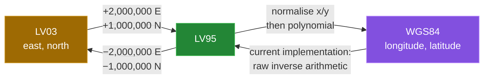

[← back to the overview](../README.md)

# Transformer

`Transformer` contains four static operations. Two are exact coordinate-origin
offsets between LV03 and LV95. The other two are polynomial approximations
between LV95 and WGS84.



## LV03 and LV95

The two Swiss grid systems are related here by fixed offsets:

```java
LV95 = LV03 + (2_000_000 east, 1_000_000 north)
LV03 = LV95 - (2_000_000 east, 1_000_000 north)
```

The `height` reference is returned unchanged by these two methods. The
measurement runner sampled `888` points in both directions with a `10,000` m
step; the largest observed horizontal residual was `0.000000` m and the
height comparison was exact. These are round-trip results for the fixed
offset, not a geodetic accuracy claim.

## LV95 to WGS84

The forward method normalises the LV95 axes as follows:

```text
y = (east  - 2600000) / 1000000
x = (north - 1200000) / 1000000
```

It evaluates one polynomial for longitude and one for latitude, then converts
the intermediate values with `* 100 / 36`. When height is non-null, the source
applies:

```text
wgs84Height = height + 49.55 - 12.60*y - 22.64*x
```

The verified quick-start sample is:

```text
LV95 -> WGS84: lon=7.438637222 lat=46.951081111 height=null
```

## WGS84 to LV95

The public object path is currently broken before it can return a value; see
[Bugs found](BUGS-FOUND.md). The static method does return a result, but its
current arithmetic uses inputs at arcsecond scale and effectively expects
latitude arcseconds in the first argument and longitude arcseconds in the
second. That convention is inferred from the source and verified by the
measurement probe; it is not stated by the current Javadoc.

For the sample WGS84 point, the current static call is equivalent to:

```java
Double[] lv95 = Transformer.wgs84ToLV95(
        46.951082 * 3600.0,
        7.438632 * 3600.0,
        null);
```

The measured result is:

```text
direct lat/lon arcseconds: E=2599999.9488 N=1199999.9296
```

The current `WGS84.toLV95()` call instead reports
`ArrayIndexOutOfBoundsException: Index 3 out of bounds for length 3`, even
though the static method allocated three result slots.

## Accuracy boundary

The two polynomial directions are approximations. The repository contains no
known reference-point test against an authoritative WGS84/LV95 data source,
so absolute accuracy is **not measured**. The `10,000` m grid result in the
[measurement report](measurement.md) is only the residual after passing values
through the two implemented polynomial formulas with the static method's
current effective convention.
